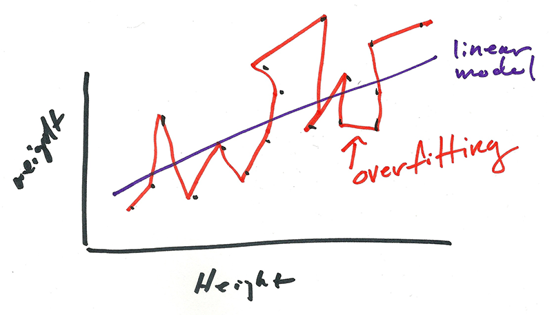

# Overfitting

Before we start playing with parameters, we should talk about overfitting. The risk of overfitting is finding a parameter or set of parameters that results in a model that rocks with test data but fails horribly on real world data. An easy example of overfitting is to imagine a scatterplot of people's weights versus their heights. For the imagination impaired, I drew this awesome chart.

Height is along the x-axis while weight is along the y-axis. Each black point represents a persons's weight an height. The upward sloping purple line represents a line that a linear model may come up with. The orange line connects the dots and fits our training data perfectly. 

A perfectly fitted model might seem like a good thing but ask yourself how you would use this model on a new data point. You probably have to redraw the whole thing. Intuitively, we know our overfitted model doesn't make any sense since in our experience we know taller people will generally be heavier within a certain threshold of error. 

Working to avoid overfitting might seem obvious but as you deal with more dimensions of data and parameters it's hard visualize where you might get tripped. The problem gets more exacerbated when you start employing machine learning algorithms where there's a black box aspect to how the algorithm comes up with the paramter. 

The best way to avoid this is to make sure there is some logic to setting your parameter. There should be some intuitive logic based on domain knowledge to coming up with a value of a paramter. You should also try to avoid mindlessly running a different iterations of a single parameter. A good example of this is trying to figure out the optimal number of days to be used for a daily moving average. 

## LSTM parameters

After all the dire warnings of overfitting, let's take a look at the parameters we can tweak in an LSTM model and figure out how we can avoid overfitting. 

batch size
epoch
lookback period
time steps (similar to lookback period)
number of neurons - the weight. should be 1 for each input variable.
hidden layers
Dense
